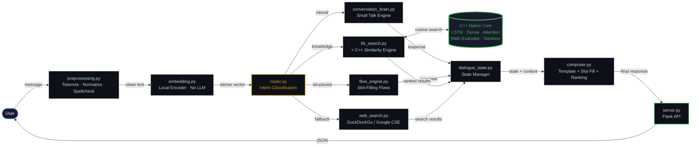
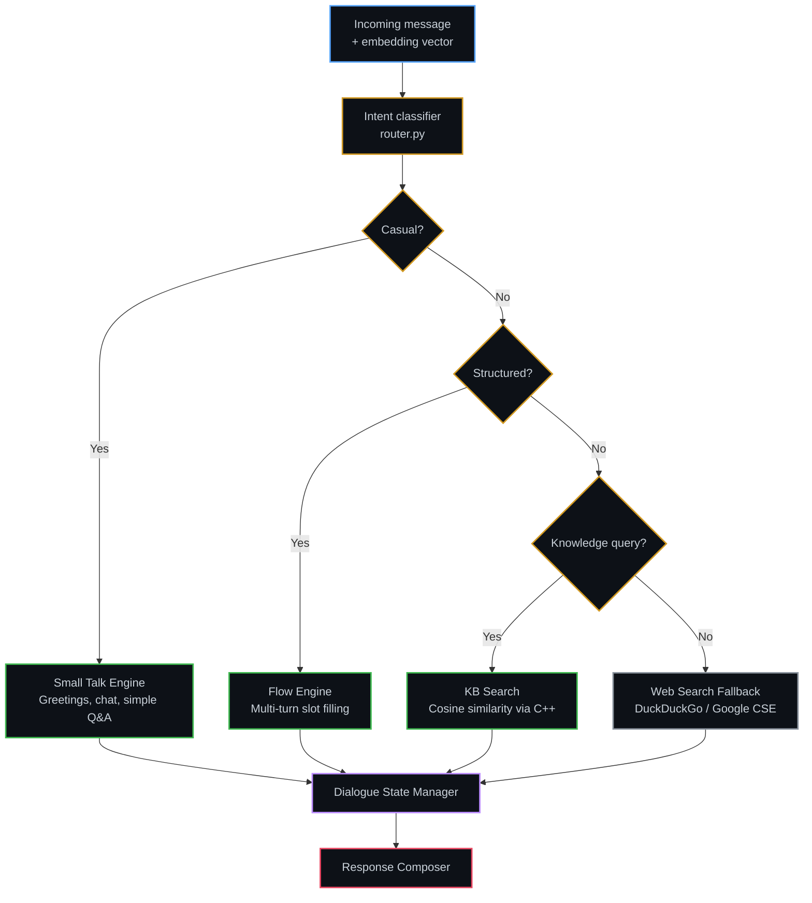
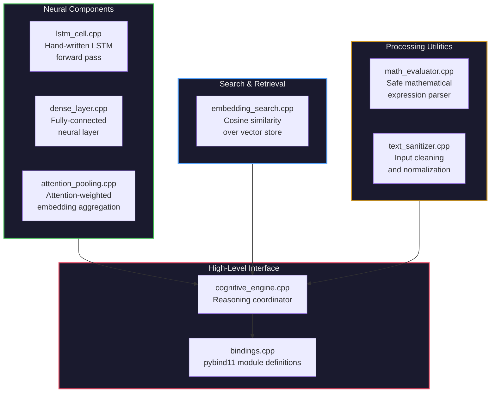

<div align="center">

# Hybrid C++/Python Chatbot

**A high-performance conversational AI engine built from scratch — no LLMs, no generative models, no external inference APIs.**

[](.)
[](https://python.org)
[](https://pybind11.readthedocs.io)
[](.)
[](https://chatbothybrid-1.onrender.com/)
[](.)

<br/>

*Hand-written LSTM · Native Cosine Search · Attention Pooling · Deterministic · Offline-First*

Every response is traceable, reproducible, and explainable. C++ handles the numerics, Python orchestrates the conversation.

<br/>

[Architecture](#system-architecture) · [C++ Engine](#native-c-engine) · [Quick Start](#quick-start) · [Components](#core-components)

---

</div>

## Table of Contents

<details>
<summary><b>Click to expand</b></summary>

1. [Why This Exists](#why-this-exists)
2. [Key Highlights](#key-highlights)
3. [System Architecture](#system-architecture)
4. [Core Components](#core-components)
5. [Native C++ Engine](#native-c-engine)
6. [Repository Structure](#repository-structure)
7. [Quick Start](#quick-start)
8. [Usage Example](#usage-example)
9. [Testing](#testing)
10. [Configuration](#configuration)
11. [Design Philosophy](#design-philosophy)
12. [Roadmap](#roadmap)
13. [Tech Stack](#tech-stack)
14. [License](#license)

</details>

---

## Why This Exists

Modern chatbots default to throwing billions of parameters at every problem. This project takes the opposite approach:

> [!IMPORTANT]
> What if you could build a genuinely useful conversational system using only deterministic algorithms, hand-crafted neural components, and classical NLP — running entirely offline?

The result is a hybrid architecture where **C++ handles the heavy numerical lifting** and **Python orchestrates the conversation flow**, connected via pybind11 bindings.

---

## Key Highlights

<table>
<tr>
<td width="50%">

**Performance**
- Hand-written LSTM inference engine in C++
- Native cosine similarity search — no vector DB overhead
- Attention pooling for embedding aggregation
- Sub-millisecond response times on CPU

</td>
<td width="50%">

**Intelligence**
- Multi-turn dialogue with state tracking
- Slot-filling conversation flows
- Semantic knowledge retrieval via embedding search
- Intent routing across 4 specialized subsystems

</td>
</tr>
<tr>
<td width="50%">

**Reliability**
- Fully deterministic — same input, same output
- Offline-first — no API keys required to run
- Zero hallucination — retrieves, never generates
- Comprehensive unit + integration tests

</td>
<td width="50%">

**Modularity**
- Swap embedding models without touching other code
- Optional web search fallback when local KB falls short
- Clean separation: compute (C++) / logic (Python)
- Production-ready project organization

</td>
</tr>
</table>

---

## System Architecture

### Full Message Flow



Messages flow left-to-right through preprocessing, embedding, and intent routing. The router dispatches to one of four subsystems. All paths converge at the Dialogue State Manager, which feeds the Response Composer. The **C++ Native Core** (cylinder) powers the KB search with hand-written LSTM, dense layers, attention pooling, and cosine similarity.

### Intent Routing Logic



---

## Core Components

| Layer | Component | File | Description |
|:---|:---|:---|:---|
| **Input** | Preprocessor | `preprocessing.py` | Tokenization, normalization, spell correction |
| **Encoding** | Embedding Layer | `embedding.py` | Text to dense vector via local encoder (no LLM) |
| **Routing** | Intent Router | `router.py` | Classifies intent and dispatches to subsystem |
| **Processing** | Small Talk Engine | `conversation_brain.py` | Greetings, casual chat, simple Q&A |
| | Flow Engine | `flow_engine.py` | Multi-turn slot-filling conversations |
| | KB Search | `kb_search.py` | Semantic document retrieval via C++ engine |
| | Web Search | `web_search.py` | Optional live search fallback (DuckDuckGo / Google CSE) |
| **State** | Dialogue Manager | `dialogue_state.py` | Conversation history and active state tracking |
| **Output** | Response Composer | `composer.py` | Template selection, slot filling, response ranking |
| **API** | Server | `server.py` | Flask web server with chat UI |

---

## Native C++ Engine

All performance-critical numerical computation is implemented in **C++17** and exposed to Python via **pybind11**.

### Engine Module Architecture



### Source Files

```
cpp/src/
├── lstm_cell.cpp/.h            ← Hand-written LSTM forward pass
├── dense_layer.cpp/.h          ← Fully-connected neural layer
├── attention_pooling.cpp/.h    ← Attention-weighted embedding aggregation
├── embedding_search.cpp/.h     ← Cosine similarity search over vector store
├── math_evaluator.cpp/.h       ← Safe mathematical expression parser
├── text_sanitizer.cpp/.h       ← Input cleaning and normalization
├── cognitive_engine.cpp/.h     ← High-level reasoning coordinator
└── bindings.cpp                ← pybind11 module definitions
```

<details>
<summary><b>Why C++ instead of NumPy/PyTorch?</b></summary>

| Reason | Explanation |
|:---|:---|
| **No framework overhead** | Raw loops beat NumPy for small tensor ops |
| **Deterministic execution** | No graph compilation variability |
| **Single binary** | No CUDA/cuDNN/MKL dependency chain |
| **Educational value** | Understand neural computation at the metal level |

</details>

---

## Repository Structure

<details>
<summary><b>Click to expand full project tree</b></summary>

```
ChatBothybrid/
├── cpp/                              ← Native C++ compute engine
│   ├── src/                             LSTM, Dense, Attention, Search, Math, Sanitizer
│   ├── tests/                           Smoke tests for pybind11 bindings
│   ├── CMakeLists.txt                   CMake build configuration
│   └── Makefile                         Alternative Make build
│
├── orchestrator/                     ← Python conversation orchestrator
│   ├── preprocessing.py                 Input cleaning and tokenization
│   ├── embedding.py                     Text-to-vector encoding
│   ├── kb_search.py                     Knowledge base retrieval
│   ├── router.py                        Intent classification and dispatch
│   ├── flow_engine.py                   Multi-turn conversation flows
│   ├── dialogue_state.py                Conversation state management
│   ├── conversation_brain.py            Small talk and casual conversation
│   ├── generative_brain.py              Response generation logic
│   ├── composer.py                      Template-based response composition
│   ├── server.py                        Flask web server
│   ├── main.py                          CLI entry point
│   ├── static/                          Frontend assets
│   └── tool_dispatch/                   External tool integrations
│       ├── cache.py                        Response caching
│       └── web_search.py                   Google CSE fallback
│
├── tests/                            ← Test suite
│   ├── test_conversation.py
│   ├── test_deep_lstm.py
│   ├── test_kb_search.py
│   ├── test_math_and_cognitive.py
│   ├── test_pipeline_integration.py
│   └── test_summarizer.py
│
├── requirements.txt
└── README.md
```

</details>

---

## Quick Start

### Prerequisites

| Tool | Version |
|:---|:---|
| Python | 3.10+ |
| GCC / Clang / MSVC | C++17 support |
| Make or CMake | Latest stable |

### 1. Clone and install

```bash
git clone https://github.com/AnshumanJ28/ChatBothybrid.git
cd ChatBothybrid
pip install -r requirements.txt
```

### 2. Build the C++ engine

| Build System | Command |
|:---|:---|
| **Make** | `cd cpp && make` |
| **CMake** | `mkdir build && cd build && cmake .. && cmake --build .` |

### 3. Run

```bash
# Launch the web interface
python orchestrator/server.py

# Or use the CLI
python orchestrator/main.py
```

Then open [http://localhost:5000](http://localhost:5000) or visit the [live demo](https://chatbothybrid-1.onrender.com/).

> [!TIP]
> No API keys, no `.env` file, no cloud dependency. The chatbot works fully offline out of the box using its local knowledge base and deterministic encoder.

---

## Usage Example

```python
from orchestrator.main import ChatSession

chat = ChatSession()

chat.handle("Hello")
# -> "Hi there! How can I help you today?"

chat.handle("How do I reset my password?")
# -> Retrieves answer from knowledge base

chat.handle("I want to return my order.")
# -> Enters slot-filling flow

chat.handle("Order number is 12345")
# -> Fills 'order_id' slot, continues flow

chat.handle("The package arrived damaged.")
# -> Routes to appropriate KB article
```

---

## Testing

```bash
python tests/test_conversation.py
python tests/test_deep_lstm.py
python tests/test_kb_search.py
python tests/test_math_and_cognitive.py
python tests/test_pipeline_integration.py
python tests/test_summarizer.py
```

---

## Configuration

### Swap the Embedding Model

The default encoder uses a deterministic hashing function (fully offline). Drop in a real model with zero code changes elsewhere:

```python
from sentence_transformers import SentenceTransformer

model = SentenceTransformer("all-MiniLM-L6-v2")

def encode(text):
    return model.encode(text).tolist()
```

### Enable Live Web Search

| Provider | Setup | Notes |
|:---|:---|:---|
| **DuckDuckGo** | Works out of the box | No API key needed, local only |
| **Google CSE** | Set `GOOGLE_CSE_API_KEY` and `GOOGLE_CSE_CX` env vars | Requires a Google Custom Search account |
| **None** | Default | Falls back silently to offline KB |

> [!WARNING]
> **DuckDuckGo on cloud deployments:** DuckDuckGo search works locally but is **blocked on cloud platforms** (Render, Railway, Heroku) due to rate-limiting and IP-based restrictions. The [live demo](https://chatbothybrid-1.onrender.com/) runs without web search — all responses come from the local knowledge base and conversation engine. To experience web search, run the chatbot locally.

---

## Design Philosophy

| Principle | Rationale |
|:---|:---|
| **No LLMs** | Proves conversational AI doesn't require generative models |
| **Deterministic** | Same input always produces the same output — fully debuggable |
| **Offline-first** | Runs anywhere, no API keys, no cloud dependency |
| **Hybrid architecture** | Right tool for the job: C++ for speed, Python for flexibility |
| **Modular** | Every component is independently replaceable and testable |
| **Explainable** | Every response can be traced to a specific retrieval or rule |

---

## Roadmap

- [ ] SIMD-optimized vector operations
- [ ] Approximate nearest-neighbor indexing (HNSW)
- [ ] Persistent vector database integration
- [ ] GPU acceleration for batch inference
- [ ] Trained LSTM weight loading from checkpoint files
- [ ] Voice interface (speech-to-text / pipeline / text-to-speech)
- [ ] REST API with OpenAPI documentation
- [ ] Web dashboard with conversation analytics

---

## Tech Stack

| Category | Technologies |
|:---|:---|
| **Languages** | C++17, Python 3.10+ |
| **Bindings** | pybind11 |
| **Web** | Flask |
| **ML (optional)** | sentence-transformers, NumPy |
| **Search (optional)** | Google Custom Search API, DuckDuckGo |
| **Build** | Make, CMake |
| **Compilers** | GCC, Clang, MSVC |

---

## License

This project is intended for **educational and research purposes**.

---

<div align="center">

### No LLM. No Generation. No Hallucination.

*Hand-written LSTM · Native Cosine Search · Attention Pooling · Deterministic · Offline-First*

**Every response retrieved, computed, and traced — never generated.**

<br/>

Star this repo if you found it interesting!

---

*Made by [Anshuman](https://github.com/AnshumanJ28)*

</div>
