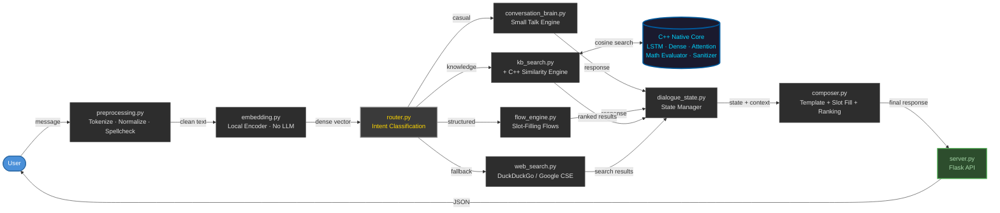

<p align="center">
  
  
  
  
  
</p>

<h1 align="center">Hybrid C++/Python Chatbot</h1>

<p align="center">
  <strong>A high-performance conversational AI engine built from scratch — no LLMs, no generative models, no external inference APIs.</strong>
</p>

<p align="center">
  <a href="https://chatbothybrid-1.onrender.com/">Live Demo</a> &nbsp;•&nbsp;
  <a href="#system-architecture">Architecture</a> &nbsp;•&nbsp;
  <a href="#quick-start">Quick Start</a> &nbsp;•&nbsp;
  <a href="#core-components">Components</a>
</p>

---

## Why This Exists

Modern chatbots default to throwing billions of parameters at every problem. This project takes the opposite approach:

> **What if you could build a genuinely useful conversational system using only deterministic algorithms, hand-crafted neural components, and classical NLP — running entirely offline?**

The result is a hybrid architecture where **C++ handles the heavy numerical lifting** and **Python orchestrates the conversation flow**, connected via pybind11 bindings. Every response is traceable, reproducible, and explainable.

---

## Key Highlights

<table>
<tr>
<td width="50%">

### Performance
- Hand-written **LSTM inference engine** in C++
- Native **cosine similarity search** — no vector DB overhead
- **Attention pooling** for embedding aggregation
- Sub-millisecond response times on CPU

</td>
<td width="50%">

### Intelligence
- **Multi-turn dialogue** with state tracking
- **Slot-filling** conversation flows
- **Semantic knowledge retrieval** via embedding search
- **Intent routing** across 4 specialized subsystems

</td>
</tr>
<tr>
<td width="50%">

### Reliability
- **Fully deterministic** — same input, same output
- **Offline-first** — no API keys required to run
- **Zero hallucination** — retrieves, never generates
- Comprehensive **unit + integration tests**

</td>
<td width="50%">

### Modularity
- Swap embedding models without touching other code
- Optional **web search fallback** when local KB falls short
- Clean separation: **compute (C++) ↔ logic (Python)**
- Production-ready project organization

</td>
</tr>
</table>

---

## System Architecture



> **Reading the diagram:** Messages flow left-to-right through preprocessing, embedding, and intent routing. The router dispatches to one of four subsystems. All paths converge at the Dialogue State Manager, which feeds the Response Composer. The **C++ Native Core** (cylinder) powers the KB search with hand-written LSTM, dense layers, attention pooling, and cosine similarity.

---

## Core Components

| Layer | Component | File | Description |
|-------|-----------|------|-------------|
| **Input** | Preprocessor | `preprocessing.py` | Tokenization, normalization, spell correction |
| **Encoding** | Embedding Layer | `embedding.py` | Text → dense vector via local encoder (no LLM) |
| **Routing** | Intent Router | `router.py` | Classifies intent and dispatches to subsystem |
| **Processing** | Small Talk Engine | `conversation_brain.py` | Greetings, casual chat, simple Q&A |
| | Flow Engine | `flow_engine.py` | Multi-turn slot-filling conversations |
| | KB Search | `kb_search.py` | Semantic document retrieval via C++ engine |
| | Web Search | `web_search.py` | Optional live search fallback (DuckDuckGo / Google CSE) |
| **State** | Dialogue Manager | `dialogue_state.py` | Conversation history & active state tracking |
| **Output** | Response Composer | `composer.py` | Template selection, slot filling, response ranking |
| **API** | Server | `server.py` | Flask web server with chat UI |

---

## Native C++ Engine

All performance-critical numerical computation is implemented in **C++17** and exposed to Python via **pybind11**:

```
cpp/src/
├── lstm_cell.cpp/.h            # Hand-written LSTM forward pass
├── dense_layer.cpp/.h          # Fully-connected neural layer
├── attention_pooling.cpp/.h    # Attention-weighted embedding aggregation
├── embedding_search.cpp/.h     # Cosine similarity search over vector store
├── math_evaluator.cpp/.h       # Safe mathematical expression parser
├── text_sanitizer.cpp/.h       # Input cleaning & normalization
├── cognitive_engine.cpp/.h     # High-level reasoning coordinator
└── bindings.cpp                # pybind11 module definitions
```

<details>
<summary><strong>Why C++ instead of NumPy/PyTorch?</strong></summary>

- **No framework overhead** — raw loops beat NumPy for small tensor ops
- **Deterministic execution** — no graph compilation variability
- **Single binary** — no CUDA/cuDNN/MKL dependency chain
- **Educational value** — understand neural computation at the metal level

</details>

---

## Repository Structure

```
ChatBothybrid/
│
├── cpp/                          # ← Native C++ compute engine
│   ├── src/                      #    LSTM, Dense, Attention, Search, Math, Sanitizer
│   ├── tests/                    #    Smoke tests for pybind11 bindings
│   ├── CMakeLists.txt            #    CMake build configuration
│   └── Makefile                  #    Alternative Make build
│
├── orchestrator/                 # ← Python conversation orchestrator
│   ├── preprocessing.py          #    Input cleaning & tokenization
│   ├── embedding.py              #    Text-to-vector encoding
│   ├── kb_search.py              #    Knowledge base retrieval
│   ├── router.py                 #    Intent classification & dispatch
│   ├── flow_engine.py            #    Multi-turn conversation flows
│   ├── dialogue_state.py         #    Conversation state management
│   ├── conversation_brain.py     #    Small talk & casual conversation
│   ├── generative_brain.py       #    Response generation logic
│   ├── composer.py               #    Template-based response composition
│   ├── server.py                 #    Flask web server
│   ├── main.py                   #    CLI entry point
│   ├── static/                   #    Frontend assets
│   └── tool_dispatch/            #    External tool integrations
│       ├── cache.py              #        Response caching
│       └── web_search.py         #        Google CSE fallback
│
├── tests/                        # ← Test suite
│   ├── test_conversation.py
│   ├── test_deep_lstm.py
│   ├── test_kb_search.py
│   ├── test_math_and_cognitive.py
│   ├── test_pipeline_integration.py
│   └── test_summarizer.py
│
├── requirements.txt
├── README.md
└── .gitignore
```

---

## Quick Start

### Prerequisites

| Tool | Version |
|------|---------|
| Python | 3.10+ |
| GCC / Clang / MSVC | C++17 support |
| Make or CMake | Latest stable |

### 1. Clone & Install

```bash
git clone https://github.com/AnshumanJ28/ChatBothybrid.git
cd ChatBothybrid
pip install -r requirements.txt
```

### 2. Build the C++ Engine

**Option A — Make:**
```bash
cd cpp && make
```

**Option B — CMake:**
```bash
mkdir build && cd build
cmake .. && cmake --build .
```

### 3. Run

```bash
# Launch the web interface
python orchestrator/server.py

# Or use the CLI
python orchestrator/main.py
```

Then open [http://localhost:5000](http://localhost:5000) or visit the [live demo](https://chatbothybrid-1.onrender.com/).

---

## Usage Example

```python
from orchestrator.main import ChatSession

chat = ChatSession()

chat.handle("Hello")
# → "Hi there! How can I help you today?"

chat.handle("How do I reset my password?")
# → Retrieves answer from knowledge base

chat.handle("I want to return my order.")
# → Enters slot-filling flow

chat.handle("Order number is 12345")
# → Fills 'order_id' slot, continues flow

chat.handle("The package arrived damaged.")
# → Routes to appropriate KB article
```

---

## Testing

```bash
# Run individual test suites
python tests/test_conversation.py
python tests/test_deep_lstm.py
python tests/test_kb_search.py
python tests/test_math_and_cognitive.py
python tests/test_pipeline_integration.py
python tests/test_summarizer.py
```

---

## Configuration

### Swap the Embedding Model

The default encoder uses a deterministic hashing function (fully offline). Drop in a real model with zero code changes elsewhere:

```python
from sentence_transformers import SentenceTransformer

model = SentenceTransformer("all-MiniLM-L6-v2")

def encode(text):
    return model.encode(text).tolist()
```

### Enable Live Web Search

**DuckDuckGo** (default — no API key needed):
Works out of the box locally. No configuration required.

**Google Custom Search** (alternative):
```bash
export GOOGLE_CSE_API_KEY=your_api_key
export GOOGLE_CSE_CX=your_search_engine_id
```

If no search provider is available, the chatbot silently falls back to its offline knowledge base.

> [!WARNING]
> **DuckDuckGo on Cloud Deployments:** DuckDuckGo search works perfectly when running locally but is **blocked on cloud platforms** (Render, Railway, Heroku, etc.) due to rate-limiting and IP-based restrictions on server-side requests. The [live demo](https://chatbothybrid-1.onrender.com/) runs without web search — all responses come from the local knowledge base and conversation engine. To experience web search, run the chatbot locally.

---

## Design Philosophy

| Principle | Rationale |
|-----------|-----------|
| **No LLMs** | Proves conversational AI doesn't require generative models |
| **Deterministic** | Same input always produces the same output — fully debuggable |
| **Offline-first** | Runs anywhere, no API keys, no cloud dependency |
| **Hybrid architecture** | Right tool for the job: C++ for speed, Python for flexibility |
| **Modular** | Every component is independently replaceable and testable |
| **Explainable** | Every response can be traced to a specific retrieval or rule |

---

## Roadmap

- [ ] SIMD-optimized vector operations
- [ ] Approximate nearest-neighbor indexing (HNSW)
- [ ] Persistent vector database integration
- [ ] GPU acceleration for batch inference
- [ ] Trained LSTM weight loading from checkpoint files
- [ ] Voice interface (speech-to-text → pipeline → text-to-speech)
- [ ] REST API with OpenAPI documentation
- [ ] Web dashboard with conversation analytics

---

## Tech Stack

| Category | Technologies |
|----------|-------------|
| **Languages** | C++17, Python 3.10+ |
| **Bindings** | pybind11 |
| **Web** | Flask |
| **ML (optional)** | sentence-transformers, NumPy |
| **Search (optional)** | Google Custom Search API |
| **Build** | Make, CMake |
| **Compilers** | GCC, Clang, MSVC |

---

## License

This project is intended for **educational and research purposes**.

---

<p align="center">
  <sub>Built with zero LLMs · <a href="https://chatbothybrid-1.onrender.com/">Try the live demo →</a></sub>
</p>
